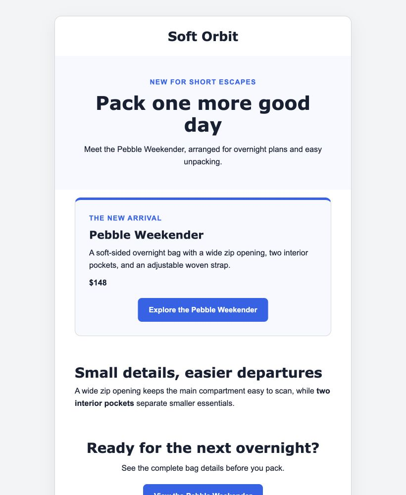
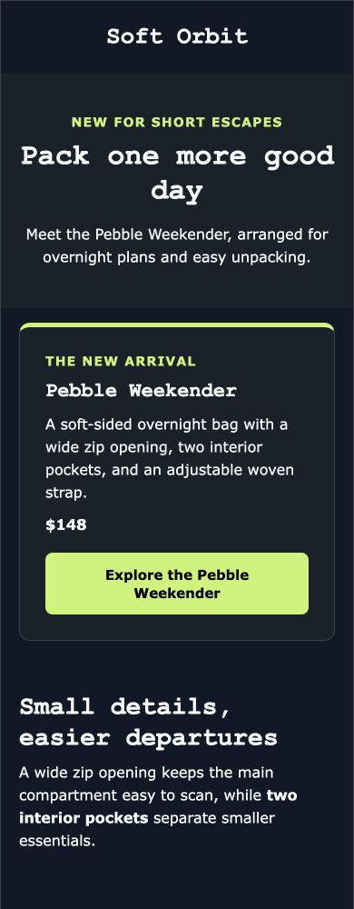

<p align="center">
  
</p>

<p align="center">
  <a href="https://github.com/plmn95/punch/actions/workflows/ci.yml"></a>
  <a href="LICENSE"></a>
  
  
</p>

Punch turns one brand website and one to six product pages into a grounded,
responsive ecommerce email. It extracts evidence, asks Claude for a semantic
campaign, checks product and claim associations deterministically, then renders
it with configurable brand colours and fonts. The result is standalone HTML
and machine-readable validation artifacts.

It is an engine and CLI, not an ESP. Punch does not manage contacts, send
messages or hide unsupported claims behind a confidence score.

```text
website + product pages
        ↓
bounded evidence extraction
        ↓
emit → critique → conditional revision
        ↓
product, claim, link and render validation
        ↓
email.html + campaign.json + validation.json
```

## Why Punch

Most AI email demos stop at plausible copy or unconstrained HTML. Punch keeps
the useful generative part while making commerce facts inspectable:

- every supplied product is required;
- product names, prices, images and CTAs stay bound to stable product IDs;
- unknown or conflicted critical facts cannot be promoted to truth;
- availability, promotion and selected high-risk claims require source support;
- Claude produces semantic blocks, never raw layout HTML;
- website style roles inform a validated brand theme, with explicit overrides
  and readable fallbacks;
- final HTML passes deterministic accessibility, geometry, resource and
  compliance-placeholder checks; and
- public fetching rejects local/private networks, unsafe redirects, oversized
  responses and credential-bearing URLs.

## One campaign, different looks

Change colours and fonts without changing the products, copy or links, or
making another AI call. These screenshots show the same fictional campaign
rendered with two brand profiles, on desktop and mobile. Click either image
to inspect it at full resolution.

<table>
  <tr>
    <th>Blue · desktop</th>
    <th>Dark · mobile</th>
  </tr>
  <tr>
    <td width="67%" valign="top"><a href="docs/showcase/branding/blue-desktop.jpg"></a></td>
    <td width="33%" valign="top"><a href="docs/showcase/branding/dark-mobile.jpg"></a></td>
  </tr>
</table>

These are renderer examples, not fresh AI generations or automatic brand-detection
results. [Reproduce them without an API key](docs/showcase/branding/README.md).
For an end-to-end generation with source evidence and a validation record,
see the [recorded Northstar Goods live run](docs/showcase/README.md).

## Quick start

Punch currently ships from source. Node.js 24 or newer is required; an Anthropic
API key is needed for generation, but not for rendering an existing campaign.

```bash
git clone https://github.com/plmn95/punch.git
cd punch
npm ci
npm run build

export ANTHROPIC_API_KEY="your-key"

node dist/cli/bin.js generate \
  --website "https://example.com" \
  --product "https://example.com/products/first-product" \
  --product "https://example.com/products/second-product" \
  --goal "sales" \
  --output "./campaign"
```

The output directory must not already exist:

```text
campaign/
├── email.html
├── campaign.json
└── validation.json
```

Add `--trace` for redacted structured stage artifacts or `--json` for exactly
one terminal JSON result on stdout. Run `node dist/cli/bin.js --help` for the
complete explicit interface.

### Guided input and brand settings

Run `node dist/cli/bin.js` in a terminal to start the optional guide. It collects
website/product URLs and the campaign brief, shows detected colours and fonts,
then asks for confirmation **before any AI call**. Keep the detected settings
with Enter, change individual six-digit hex colours or font families, preview
the actual email in a browser, and export when ready.

Complete commands stay prompt-free. Add `--interactive` to request review even
with complete inputs. `--json`, `--no-interactive`, CI and non-TTY input/output
always disable prompting.

```bash
node dist/cli/bin.js generate \
  --website "https://example.com" \
  --product "https://example.com/products/first-product" \
  --goal "sales" \
  --primary-colour "#2563EB" \
  --heading-font "Verdana" \
  --save-brand "./brand.json" \
  --output "./campaign"
```

Use `--brand ./brand.json` to reuse a saved profile. Explicit flags override
the profile; supplied settings override website detection. Output paths and
profile filenames must be new; Punch never overwrites an existing profile.

### Restyle without another AI call

The guide's **adjust branding** action re-renders the same campaign without
changing its copy or spending more model tokens. Saved campaigns can also be
restyled without an API key:

```bash
node dist/cli/bin.js render \
  --campaign "./campaign/campaign.json" \
  --primary-colour "#006644" \
  --output "./campaign-green"
```

Render-only output is explicitly labelled `render-only` in its validation
metadata: it checks the HTML, not current product facts or source grounding.
Saved campaign settings are retained unless overridden. See
[brand settings and CLI behaviour](docs/brand-settings.md) for the full contract.

## Custom campaign briefs

Punch has three fixed goal policies and open-ended campaign direction. Keep the
factual rules of `sales`, `product-launch` or `promotion`, then add a bounded
brief with `--instructions`:

```bash
node dist/cli/bin.js generate \
  --website "https://example.com" \
  --product "https://example.com/products/first-product" \
  --goal "sales" \
  --instructions "Create a concise gift guide for first-time buyers." \
  --output "./campaign"
```

Useful briefs include a buying angle, intended reader, hierarchy or tone. They
cannot authorise invented facts, unknown products, unsupported offers or a
different goal policy. In other words: three safety modes, unlimited campaign
briefs.

The same seam is available through the TypeScript API:

```ts
const giftGuide = {
  goal: "sales" as const,
  instructions: "Create a gift guide organised by recipient.",
};

await generateCampaign({ website, products, ...giftGuide }, { provider });
```

## TypeScript API

```ts
import { createAnthropicProvider, generateCampaign } from "punch-email";

const result = await generateCampaign(
  {
    website: "https://example.com",
    products: ["https://example.com/products/first-product"],
    goal: "sales",
  },
  {
    provider: createAnthropicProvider({
      apiKey: process.env.ANTHROPIC_API_KEY!,
    }),
  },
);

console.log(result.campaign);
console.log(result.validation);
```

The root package also exports the Zod schemas, standalone renderer and
deterministic claim, grounding and rendered-output validators for composed
workflows. There is intentionally no public multi-provider plugin framework in
`0.1.0`.

## Goals

| Goal             | Meaning                                                                                |
| ---------------- | -------------------------------------------------------------------------------------- |
| `sales`          | Evergreen selling. Punch rejects inferred discounts, urgency, codes and deadlines.     |
| `product-launch` | A new product, collection, drop or restock.                                            |
| `promotion`      | An offer supplied explicitly through structured description, code and deadline fields. |

## Safety and privacy

Punch treats fetched pages as untrusted data. Source text cannot select tools,
models, paths, stages or policies. Provider credentials stay outside the core
engine and are never written to artifacts. Traces are opt-in, field-allowlisted
and exclude raw pages, provider payloads, environment values and error snippets.

Bounded source content is sent to Anthropic during generation. Generated HTML
can reference remote product images, which an eventual recipient's email client
may request. See [SECURITY.md](SECURITY.md) for reporting and operational detail.

## Compliance boundary

Punch generates files; it does not send email. The renderer includes these
neutral Punch placeholders:

```text
{{unsubscribe_url}}
{{physical_address}}
```

They are not universal ESP merge tags. Callers must translate and populate
them, and remain responsible for consent, sender identity, physical address,
unsubscribe handling, destination rules and applicable law. A valid Punch
artifact is not automatically ready for lawful sending.

## Current limits

- Anthropic is the only supported provider.
- Brand detection is conservative, not a pixel-perfect website clone. Colours
  and fonts can be overridden; custom font files are not downloaded or embedded.
- Browser checks are not certification across all email clients.
- Input is one website plus one to six explicit product URLs.
- Punch does not discover products or crawl a catalogue.
- Safe forced directory replacement is unavailable in `0.1.0`; choose a fresh
  output path.
- Claim validation is conservative and intentionally bounded. Human review is
  still required before sending.
- Remote image URLs remain remote; Punch does not bundle or proxy assets.

## Development

```bash
npm ci
npm run check
npm run pack:check
```

The full check runs formatting, lint, strict TypeScript, the test suite and the
distribution build. See [CONTRIBUTING.md](CONTRIBUTING.md) before opening a pull
request.

## Licence

[MIT](LICENSE) © 2026 Plamen Hadzhiev.
