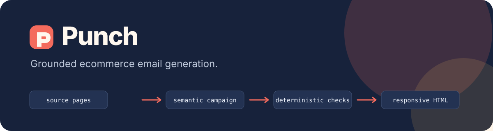

<p align="center">
  
</p>

<p align="center">
  <a href="https://github.com/plmn95/punch/actions/workflows/ci.yml"></a>
  <a href="LICENSE"></a>
  
  
</p>

Punch turns one brand website and one to six product pages into a grounded,
responsive ecommerce email. It extracts evidence, asks Claude for a semantic
campaign, checks product and claim associations deterministically, then writes
standalone HTML and machine-readable validation artifacts.

It is an engine and CLI, not an ESP. Punch does not manage contacts, send
messages or hide unsupported claims behind a confidence score.

```text
website + product pages
        ↓
bounded evidence extraction
        ↓
emit → critique → conditional revision
        ↓
product, claim, link and render validation
        ↓
email.html + campaign.json + validation.json
```

## Why Punch

Most AI email demos stop at plausible copy or unconstrained HTML. Punch keeps
the useful generative part while making commerce facts inspectable:

- every supplied product is required;
- product names, prices, images and CTAs stay bound to stable product IDs;
- unknown or conflicted critical facts cannot be promoted to truth;
- availability, promotion and selected high-risk claims require source support;
- Claude produces semantic blocks, never raw layout HTML;
- final HTML passes deterministic accessibility, geometry, resource and
  compliance-placeholder checks; and
- public fetching rejects local/private networks, unsafe redirects, oversized
  responses and credential-bearing URLs.

## Live showcase

<p align="center">
  
</p>

This campaign was generated live with Claude Sonnet 5 from two public, newly
fictional product pages. The `sales` safety policy was combined with a custom
desk-reset brief; both supplied products remained grounded and all ten campaign
and render checks passed.

[Inspect the brief, source commit and validation record](https://github.com/plmn95/punch/blob/main/docs/showcase/README.md).

## Quick start

Punch currently ships from source. Node.js 24 or newer and an Anthropic API key
are required.

```bash
git clone https://github.com/plmn95/punch.git
cd punch
npm ci
npm run build

export ANTHROPIC_API_KEY="your-key"

node dist/cli/bin.js generate \
  --website "https://example.com" \
  --product "https://example.com/products/first-product" \
  --product "https://example.com/products/second-product" \
  --goal "sales" \
  --output "./campaign"
```

The output directory must not already exist:

```text
campaign/
├── email.html
├── campaign.json
└── validation.json
```

Add `--trace` for redacted structured stage artifacts or `--json` for exactly
one terminal JSON result on stdout. Run `node dist/cli/bin.js --help` for the
complete explicit interface.

## Custom campaign briefs

Punch has three fixed goal policies and open-ended campaign direction. Keep the
factual rules of `sales`, `product-launch` or `promotion`, then add a bounded
brief with `--instructions`:

```bash
node dist/cli/bin.js generate \
  --website "https://example.com" \
  --product "https://example.com/products/first-product" \
  --goal "sales" \
  --instructions "Create a concise gift guide for first-time buyers." \
  --output "./campaign"
```

Useful briefs include a buying angle, intended reader, hierarchy or tone. They
cannot authorise invented facts, unknown products, unsupported offers or a
different goal policy. In other words: three safety modes, unlimited campaign
briefs.

The same seam is available through the TypeScript API:

```ts
const giftGuide = {
  goal: "sales" as const,
  instructions: "Create a gift guide organised by recipient.",
};

await generateCampaign({ website, products, ...giftGuide }, { provider });
```

## TypeScript API

```ts
import { createAnthropicProvider, generateCampaign } from "punch-email";

const result = await generateCampaign(
  {
    website: "https://example.com",
    products: ["https://example.com/products/first-product"],
    goal: "sales",
  },
  {
    provider: createAnthropicProvider({
      apiKey: process.env.ANTHROPIC_API_KEY!,
    }),
  },
);

console.log(result.campaign);
console.log(result.validation);
```

The root package also exports the Zod schemas, standalone renderer and
deterministic claim, grounding and rendered-output validators for composed
workflows. There is intentionally no public multi-provider plugin framework in
`0.1.0`.

## Goals

| Goal             | Meaning                                                                                |
| ---------------- | -------------------------------------------------------------------------------------- |
| `sales`          | Evergreen selling. Punch rejects inferred discounts, urgency, codes and deadlines.     |
| `product-launch` | A new product, collection, drop or restock.                                            |
| `promotion`      | An offer supplied explicitly through structured description, code and deadline fields. |

## Safety and privacy

Punch treats fetched pages as untrusted data. Source text cannot select tools,
models, paths, stages or policies. Provider credentials stay outside the core
engine and are never written to artifacts. Traces are opt-in, field-allowlisted
and exclude raw pages, provider payloads, environment values and error snippets.

Bounded source content is sent to Anthropic during generation. Generated HTML
can reference remote product images, which an eventual recipient's email client
may request. See [SECURITY.md](SECURITY.md) for reporting and operational detail.

## Compliance boundary

Punch generates files; it does not send email. The renderer includes these
neutral Punch placeholders:

```text
{{unsubscribe_url}}
{{physical_address}}
```

They are not universal ESP merge tags. Callers must translate and populate
them, and remain responsible for consent, sender identity, physical address,
unsubscribe handling, destination rules and applicable law. A valid Punch
artifact is not automatically ready for lawful sending.

## Current limits

- Anthropic is the only supported provider.
- Input is one website plus one to six explicit product URLs.
- Punch does not discover products or crawl a catalogue.
- Safe forced directory replacement is unavailable in `0.1.0`; choose a fresh
  output path.
- Claim validation is conservative and intentionally bounded. Human review is
  still required before sending.
- Remote image URLs remain remote; Punch does not bundle or proxy assets.

## Development

```bash
npm ci
npm run check
npm run pack:check
```

The full check runs formatting, lint, strict TypeScript, the test suite and the
distribution build. See [CONTRIBUTING.md](CONTRIBUTING.md) before opening a pull
request.

## Licence

[MIT](LICENSE) © 2026 Plamen Hadzhiev.
