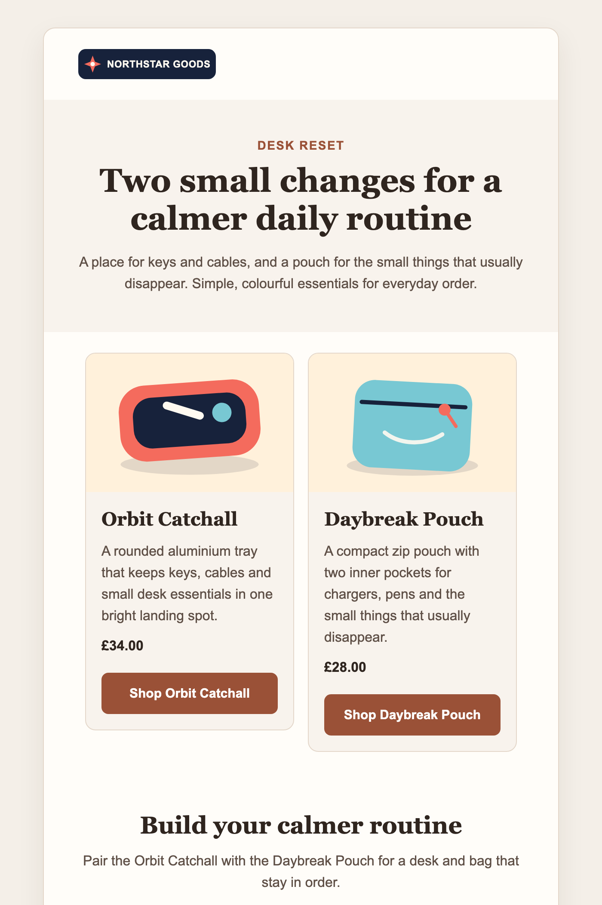

# Live Northstar Goods showcase

This is the original recorded generation, captured before brand-aware rendering
was added. Its neutral theme is retained as historical evidence. For the current
configurable renderer, see the [blue and dark brand examples](branding/README.md).



This is a real Punch generation from public HTTP input through Claude Sonnet 5,
deterministic validation, React Email rendering and atomic output. Northstar
Goods, both products, their copy and their artwork are newly fictional material
created for this repository.

## Brief

```text
Goal policy: sales
Custom instructions: Create a concise desk-reset gift guide for people building
calmer daily routines. Feature both products equally.
```

The source pages are pinned at commit
[`ac59faf`](https://github.com/plmn95/punch/tree/ac59faf96b47b9ee6fafee6f360cb5c03c59d38f/docs/showcase/source).
For the live canary, their exact HTML was served through a public test endpoint;
the resulting long test URLs are intentionally omitted from the committed
showcase.

## Result

- Subject: “A calmer desk, two useful things at a time”
- Blocks: header, hero, two-column product grid and closing CTA
- Products: Orbit Catchall at 34.00 GBP and Daybreak Pouch at 28.00 GBP
- Validation: all ten grounding, claim and render checks passed
- Generation: emit and critique completed without a revision
- Secrets, raw pages and raw provider responses: absent from artifacts

The compact machine-readable record is in [`result.json`](result.json). Raw
campaign and trace artifacts are deliberately not committed because the test
endpoint encodes the fictional HTML in its URLs; they remain less readable than
the pinned source and reviewed result.

## What the canary caught

Claude Sonnet 5 enables adaptive thinking by default. Punch requires one strict
plain-text JSON response, so its adapter now explicitly disables thinking and
continues to reject every non-text response block. The live run also showed that
the earlier 60-second call deadline was too short for the current model; bounded
defaults are now 120 seconds per provider call and 360 seconds for the complete
campaign. Both remain configurable through the TypeScript API.

See Anthropic's
[Sonnet 5 migration guide](https://platform.claude.com/docs/en/models/sonnet-5/migration-guide)
for the model's thinking behaviour.
